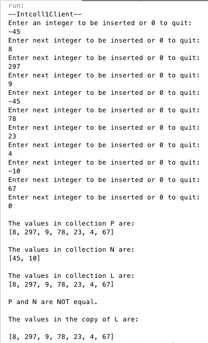

Assignment 1
============

## Part 1: Intcoll1
Constructors: 
* Intcoll1()
  * Creates an Intcoll1 instance with capacity for 500 integers + the sentinel (500+1)
* Intcoll1(int i)
  * Creates an Intcoll1 instance with capacity for *i* integers + the sentinel (i+1)

Methods:
* void copy(Intcoll1 obj)
* boolean belongs(int i)
* void insert(int i)
* void omit(int i)
* int get_howmany()
* void print()
* boolean equals(Intcoll1 obj)

### Test Run

Test flow:

1. Check if *input* is equal to the *SENTINEL* 
1. Check if number is positive or negative
  * Positive numbers get placed in collection P
  * Negative number get placed in collection N
1. If the number is positive
  * Call the *insert(**input**)* method on collection P
  * Call the *insert(int **input**)* method on collection L
1. If the number is positive
  * Call the *insert(**-input**)* method on collection N
  * Call the *omit(**-input**)* method on collection L
1. Output all 3 collections using the *print()* method on each collection