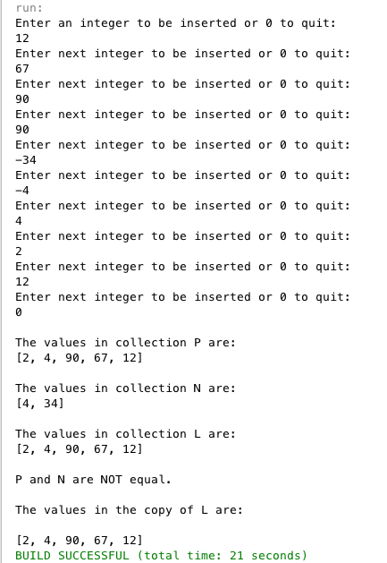

Assignment 2
============

## Intcoll4
Nested Classes:
* ListNode
  * int info
    * Contains the data of the node
  * ListNode link
    * Contains the link to the next node (or NULL for the end)
* ListNode Construstors:
  * ListNode()
    * Initializes a new ListNode object with 0 data and NULL link
  * ListNode(int i, ListNode l)
    * Unitialize info block to i, link to l (another node)

Constructors: 
* Intcoll4()
  * Creates an Intcoll4 instance with a NULL link and 0 in how_many
* Intcoll4(int i)
  * Only necesary for backwards compatibility with previous Intcoll's, does the same as Incoll4()

Methods:
* void copy(Intcoll1 obj)
* boolean belongs(int i)
* void insert(int i)
* void omit(int i)
* int get_howmany()
* void print()
* boolean equals(Intcoll1 obj)

### Test Run

Test flow:

1. Check if *input* is equal to the *SENTINEL* 
1. Check if number is positive or negative
  * Positive numbers get placed in collection P
  * Negative number get placed in collection N
1. If the number is positive
  * Call the *insert(input)* method on collection P
  * Call the *insert(input)* method on collection L
1. If the number is negative
  * Call the *insert(-input)* method on collection N
  * Call the *omit(-input)* method on collection L
1. Output all 3 collections using the *print()* method on each collection