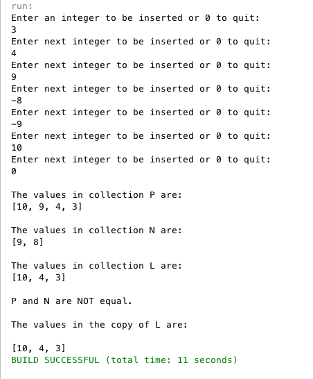

Assignment 3
============

Constructors: 
* Intcoll5()
  * Initializes `c` as a LinkedList of Integer elements
* Intcoll4(int i)
  * Only necesary for backwards compatibility with previous Intcoll's, does the same as Incoll5()

Methods:
* void copy(Intcoll5 obj)
* boolean belongs(int i)
* void insert(int i)
* void omit(int i)
* int get_howmany()
* void print()
* boolean equals(Intcoll5 obj)

### Test Run

Test flow:

1. Check if *input* is equal to the *SENTINEL* 
1. Check if number is positive or negative
  * Positive numbers get placed in collection P
  * Negative number get placed in collection N
1. If the number is positive
  * Call the *insert(input)* method on collection P
  * Call the *insert(input)* method on collection L
1. If the number is negative
  * Call the *insert(-input)* method on collection N
  * Call the *omit(-input)* method on collection L
1. Output all 3 collections using the *print()* method on each collection